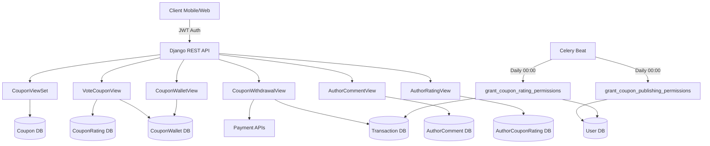
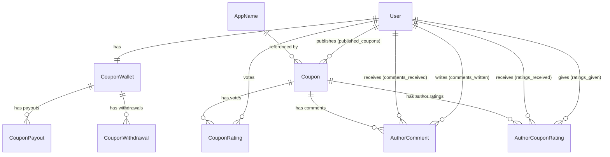

# Design Document — Coupon System V2

## Overview

Le système de coupons communautaires V2 est une fonctionnalité complète permettant aux utilisateurs qualifiés de publier des coupons de paris sportifs, de recevoir des votes (likes/dislikes), et de monétiser leur activité via un portefeuille interne. Le système s'intègre dans l'application Django existante (`mobcash_inte_backend`) et s'appuie sur les modèles `User`, `AppName`, `Transaction`, et `Network` déjà en place.

Les objectifs principaux sont :
- Permettre la publication de coupons (paris simple, combiné, système) par des utilisateurs éligibles
- Gérer un système de votes avec règles anti-abus (1 vote/jour/auteur)
- Monétiser les votes via un portefeuille (`CouponWallet`) crédité automatiquement
- Permettre le retrait des gains via Mobile Money (intégration avec les APIs de paiement existantes)
- Attribuer automatiquement les permissions via des tâches Celery planifiées
- Gérer les commentaires sur les auteurs de coupons avec réponses imbriquées

---

## Architecture

Le système suit l'architecture Django REST Framework déjà en place dans le projet. Il s'intègre dans l'application `mobcash_inte` existante (ou une nouvelle app dédiée `coupons`).



### Décisions d'architecture

1. **Intégration dans `mobcash_inte`** : Les nouveaux modèles sont ajoutés à l'app existante pour éviter la fragmentation. Les migrations sont gérées dans `mobcash_inte/migrations/`.
2. **Champs User étendus** : Trois champs sont ajoutés au modèle `User` existant (`can_publish_coupons`, `can_rate_coupons`, `coupon_points`) plutôt que de créer un modèle de profil séparé, pour simplifier les requêtes.
3. **Champs Setting étendus** : Les paramètres de configuration du système coupon sont ajoutés au modèle `Setting` singleton existant.
4. **Wallet auto-créé** : Le `CouponWallet` est créé automatiquement via signal `post_save` sur `User`, garantissant que chaque utilisateur a toujours un portefeuille.
5. **Soft delete pour les commentaires** : `AuthorComment` utilise `is_deleted=True` pour préserver l'historique et les réponses imbriquées.
6. **Votes sur l'auteur vs sur le coupon** : Deux systèmes de votes coexistent — `CouponRating` (vote sur un coupon spécifique, 1/jour/auteur) et `AuthorCouponRating` (vote global sur un auteur, 1 par auteur).

---

## Components and Interfaces

### 1. Coupon Publication (`CouponViewSet`)

**Responsabilité :** CRUD sur les coupons avec contrôle des permissions et quotas.

**Endpoints :**
- `GET /coupon` — Liste les coupons du jour (public)
- `POST /coupon` — Créer un coupon (JWT + `can_publish_coupons` ou `is_staff`)
- `GET /coupon/{pk}` — Détail d'un coupon (public)
- `PUT/PATCH/DELETE /coupon/{pk}` — Admin uniquement

**Logique de création :**
1. Vérifier `can_publish_coupons` ou `is_staff`
2. Vérifier quota journalier (`max_coupons_per_day`) et hebdomadaire (`max_coupons_per_week`)
3. Vérifier unicité coupon/app/jour (1 coupon par application bookmaker par jour)
4. Vérifier unicité du code par application
5. Calculer `potential_gain = cote × 10 000`
6. Valider `match_count >= 2` pour les coupons combinés

### 2. Système de Votes (`VoteCouponView`)

**Responsabilité :** Gérer les votes like/dislike sur les coupons avec monétisation.

**Endpoint :** `POST /coupons/{coupon_id}/vote/`

**Logique de vote :**
- Vérifier `can_rate_coupons`
- Interdire le vote sur son propre coupon
- Vérifier la règle 1 vote/jour/auteur
- Gérer les 3 cas : nouveau vote, annulation (même vote), changement (vote opposé)
- Mettre à jour `likes_count`/`dislikes_count` sur le coupon
- Mettre à jour `coupon_points` de l'auteur
- Si `enable_coupon_monetization` : ajuster `wallet.balance`

### 3. Portefeuille (`CouponWalletView`, `CouponWithdrawalView`)

**Responsabilité :** Consulter le solde et initier des retraits.

**Endpoints :**
- `GET /coupon-wallet` — Solde et statistiques (JWT)
- `POST /coupon-wallet-withdraw` — Demande de retrait (JWT)
- `GET /coupon-wallet-payouts` — Historique (Admin)

**Logique de retrait :**
1. Valider `amount >= minimum_coupon_withdrawal`
2. Valider `amount <= wallet.balance`
3. Créer une `Transaction(type_trans="coupon_withdrawal")`
4. Débiter `wallet.balance`, créditer `wallet.pending_payout`
5. Router vers l'API de paiement selon `network.withdrawal_api`
6. Finaliser via webhook (`process_coupon_withdrawal_webhook`)

### 4. Commentaires (`AuthorCommentView`)

**Responsabilité :** Commentaires sur les auteurs de coupons avec réponses imbriquées.

**Endpoints :**
- `POST /author-comments/` — Créer un commentaire (JWT)
- `GET /author-comments/?coupon_author_id=<uuid>` — Lister les commentaires d'un auteur (JWT)
- `PATCH /author-comments/{id}/` — Modifier (JWT, auteur uniquement)
- `DELETE /author-comments/{id}/` — Soft delete (JWT, auteur uniquement)

### 5. Ratings Auteur (`AuthorRatingView`)

**Responsabilité :** Vote global sur un auteur (indépendant des coupons spécifiques).

**Endpoints :**
- `POST /author-ratings/` — Voter pour un auteur (JWT)
- `GET /author-stats/{user_id}/` — Statistiques d'un auteur (JWT)

### 6. Statistiques Utilisateur (`UserCouponStatsView`)

**Endpoint :** `GET /user/coupon-stats/` — Statistiques de l'utilisateur connecté (JWT)

### 7. Tâches Celery

**`grant_coupon_publishing_permissions`** (quotidien, 00h00) :
- Attribue `can_publish_coupons=True` aux utilisateurs actifs avec ≥ 2 mois d'ancienneté

**`grant_coupon_rating_permissions`** (quotidien, 00h00) :
- Attribue `can_rate_coupons=True` aux utilisateurs actifs avec ≥ 1 mois d'ancienneté ET ≥ 15 000 FCFA de transactions acceptées

---

## Data Models

### Modèles à créer

#### Coupon (étendu depuis le modèle existant)

Le modèle `Coupon` existant dans `mobcash_inte/models.py` est minimal. Il doit être remplacé/étendu :

```python
class Coupon(models.Model):
    COUPON_TYPES = [
        ('single', 'Paris simple'),
        ('combine', 'Paris combiné'),
        ('system', 'Système'),
    ]

    id = models.UUIDField(primary_key=True, default=uuid.uuid4, editable=False)
    created_at = models.DateTimeField(auto_now_add=True)
    bet_app = models.ForeignKey(AppName, on_delete=models.CASCADE, blank=True, null=True)
    code = models.CharField(max_length=150, blank=True, null=True)
    author = models.ForeignKey(User, on_delete=models.CASCADE,
                               related_name='published_coupons', blank=True, null=True)
    likes_count = models.PositiveIntegerField(default=0)
    dislikes_count = models.PositiveIntegerField(default=0)
    coupon_type = models.CharField(max_length=20, choices=COUPON_TYPES, default='combine')
    cote = models.DecimalField(max_digits=6, decimal_places=2, default=1.00)
    match_count = models.PositiveIntegerField(default=1)
    potential_gain = models.DecimalField(max_digits=10, decimal_places=2, default=0)

    class Meta:
        ordering = ['-created_at']
```

#### CouponRating

```python
class CouponRating(models.Model):
    id = models.UUIDField(primary_key=True, default=uuid.uuid4, editable=False)
    user = models.ForeignKey(User, on_delete=models.CASCADE)
    coupon = models.ForeignKey(Coupon, on_delete=models.CASCADE)
    is_like = models.BooleanField(default=True)
    created_at = models.DateTimeField(auto_now_add=True)

    class Meta:
        unique_together = ['user', 'coupon']
```

#### CouponWallet

```python
class CouponWallet(models.Model):
    id = models.UUIDField(primary_key=True, default=uuid.uuid4, editable=False)
    user = models.OneToOneField(User, on_delete=models.CASCADE)
    balance = models.DecimalField(max_digits=10, decimal_places=2, default=0)
    total_earned = models.DecimalField(max_digits=10, decimal_places=2, default=0)
    pending_payout = models.DecimalField(max_digits=10, decimal_places=2, default=0)
    created_at = models.DateTimeField(auto_now_add=True)
    updated_at = models.DateTimeField(auto_now=True)
```

Créé automatiquement via signal :
```python
@receiver(post_save, sender=User)
def create_user_wallet(sender, instance, created, **kwargs):
    if created:
        CouponWallet.objects.create(user=instance)
```

#### CouponPayout

```python
class CouponPayout(models.Model):
    PAYOUT_STATUS = [('pending', ...), ('processing', ...), ('completed', ...), ('failed', ...), ('cancelled', ...)]
    PAYOUT_TYPE = [('automatic', ...), ('monthly', ...), ('manual', ...)]

    id = models.UUIDField(primary_key=True, default=uuid.uuid4)
    user = models.ForeignKey(User, on_delete=models.CASCADE)
    wallet = models.ForeignKey(CouponWallet, on_delete=models.CASCADE)
    amount = models.DecimalField(max_digits=10, decimal_places=2)
    payout_type = models.CharField(max_length=20, choices=PAYOUT_TYPE)
    status = models.CharField(max_length=20, choices=PAYOUT_STATUS, default='pending')
    processed_at = models.DateTimeField(null=True, blank=True)
    created_at = models.DateTimeField(auto_now_add=True)
    payment_method = models.CharField(max_length=50, default='bank_transfer')
    transaction_id = models.CharField(max_length=100, null=True, blank=True)
    notes = models.TextField(blank=True)
```

#### CouponWithdrawal

```python
class CouponWithdrawal(models.Model):
    WITHDRAWAL_STATUS = [('pending', ...), ('approved', ...), ('rejected', ...), ('completed', ...)]

    id = models.UUIDField(primary_key=True, default=uuid.uuid4)
    user = models.ForeignKey(User, on_delete=models.CASCADE)
    wallet = models.ForeignKey(CouponWallet, on_delete=models.CASCADE)
    amount = models.DecimalField(max_digits=10, decimal_places=2)
    status = models.CharField(max_length=20, choices=WITHDRAWAL_STATUS, default='pending')
    bank_name = models.CharField(max_length=100)
    account_number = models.CharField(max_length=50)
    account_holder = models.CharField(max_length=100)
    created_at = models.DateTimeField(auto_now_add=True)
    processed_at = models.DateTimeField(null=True, blank=True)
    admin_notes = models.TextField(blank=True)
```

#### AuthorComment

```python
class AuthorComment(models.Model):
    id = models.UUIDField(primary_key=True, default=uuid.uuid4, editable=False)
    author = models.ForeignKey(User, on_delete=models.CASCADE, related_name='comments_written')
    coupon_author = models.ForeignKey(User, on_delete=models.CASCADE, related_name='comments_received')
    coupon = models.ForeignKey(Coupon, on_delete=models.CASCADE, related_name='comments', null=True, blank=True)
    content = models.TextField()
    parent = models.ForeignKey('self', on_delete=models.CASCADE, null=True, blank=True, related_name='replies')
    created_at = models.DateTimeField(auto_now_add=True)
    updated_at = models.DateTimeField(auto_now=True)
    is_deleted = models.BooleanField(default=False)
    deleted_at = models.DateTimeField(null=True, blank=True)

    class Meta:
        ordering = ['-created_at']
        indexes = [
            models.Index(fields=['coupon_author', '-created_at']),
            models.Index(fields=['parent', '-created_at']),
        ]
```

#### AuthorCouponRating

```python
class AuthorCouponRating(models.Model):
    id = models.UUIDField(primary_key=True, default=uuid.uuid4, editable=False)
    user = models.ForeignKey(User, on_delete=models.CASCADE, related_name='ratings_given')
    coupon_author = models.ForeignKey(User, on_delete=models.CASCADE, related_name='ratings_received')
    coupon = models.ForeignKey(Coupon, on_delete=models.CASCADE, related_name='author_ratings', null=True, blank=True)
    is_like = models.BooleanField(default=True)
    created_at = models.DateTimeField(auto_now_add=True)
    updated_at = models.DateTimeField(auto_now=True)

    class Meta:
        unique_together = ['user', 'coupon_author']
```

### Modifications des modèles existants

#### User (accounts/models.py)

Ajouter les champs :
```python
can_publish_coupons = models.BooleanField(default=False)
can_rate_coupons = models.BooleanField(default=False)
coupon_points = models.DecimalField(max_digits=10, decimal_places=2, default=0)
```

#### Setting (mobcash_inte/models.py)

Ajouter les champs :
```python
max_coupons_per_day = models.PositiveIntegerField(default=10)
max_coupons_per_week = models.PositiveIntegerField(default=50)
enable_coupon_monetization = models.BooleanField(default=False)
minimum_coupon_withdrawal = models.DecimalField(max_digits=10, decimal_places=2, default=1000.00)
monetization_amount = models.DecimalField(max_digits=10, decimal_places=2, default=1.00)
coupon_rating_points = models.DecimalField(max_digits=4, decimal_places=2, default=1.0)
payout_mode = models.CharField(max_length=20, choices=[('immediate', 'Immédiat'), ('monthly', 'Mensuel')], default='monthly')
min_withdrawal = models.DecimalField(max_digits=10, decimal_places=2, default=10.00)
max_withdrawal_monthly = models.DecimalField(max_digits=10, decimal_places=2, default=500.00)
auto_approve_withdrawal = models.BooleanField(default=False)
coupon_enable = models.BooleanField(default=False)
```

### Diagramme des relations



---

## Correctness Properties

*A property is a characteristic or behavior that should hold true across all valid executions of a system — essentially, a formal statement about what the system should do. Properties serve as the bridge between human-readable specifications and machine-verifiable correctness guarantees.*

### Property 1: Permission grant threshold for publishing

*For any* user with `date_joined` at least 2 months in the past and `is_active=True`, after running `grant_coupon_publishing_permissions`, the user's `can_publish_coupons` field SHALL be `True`.

**Validates: Requirements 1.1**

---

### Property 2: Permission grant threshold for rating

*For any* user with `date_joined` at least 1 month in the past, `is_active=True`, and total accepted transaction amount >= 15 000 FCFA, after running `grant_coupon_rating_permissions`, the user's `can_rate_coupons` field SHALL be `True`.

**Validates: Requirements 1.2**

---

### Property 3: Potential gain calculation

*For any* coupon with a given `cote` value, the `potential_gain` stored on the coupon SHALL equal `cote * 10000`.

**Validates: Requirements 2.1**

---

### Property 4: Combined coupon match count validation

*For any* attempt to create a coupon with `coupon_type='combine'` and `match_count < 2`, the system SHALL reject the creation with a validation error.

**Validates: Requirements 2.2**

---

### Property 5: One coupon per app per day

*For any* author and bookmaker app, if a coupon already exists for that author+app combination on the current day, any subsequent creation attempt for the same author+app on the same day SHALL be rejected with HTTP 429.

**Validates: Requirements 2.3**

---

### Property 6: Daily and weekly quota enforcement

*For any* author who has already created `max_coupons_per_day` coupons today (or `max_coupons_per_week` this week), any additional coupon creation attempt SHALL be rejected with HTTP 429.

**Validates: Requirements 2.4**

---

### Property 7: Unique coupon code per app

*For any* bookmaker app, no two coupons with the same non-null code SHALL exist. Attempting to create a duplicate code for the same app SHALL be rejected with a validation error.

**Validates: Requirements 2.5**

---

### Property 8: One vote per day per author

*For any* user who has already voted on a coupon from author X today, any attempt to vote on another coupon from author X on the same day SHALL be rejected with HTTP 400.

**Validates: Requirements 3.1**

---

### Property 9: No self-voting

*For any* coupon, the author of that coupon SHALL never be able to cast a vote on it. Any such attempt SHALL be rejected with HTTP 400.

**Validates: Requirements 3.2**

---

### Property 10: Vote toggle (idempotence)

*For any* user and coupon, submitting the same vote type twice SHALL result in the vote being cancelled (no active vote), and the coupon's like/dislike counts SHALL return to their pre-vote values.

**Validates: Requirements 3.3**

---

### Property 11: Vote change updates correctly

*For any* user and coupon where the user has an existing vote, submitting the opposite vote type SHALL update the vote, decrement the old count, and increment the new count — resulting in a net change of -1 on the old type and +1 on the new type.

**Validates: Requirements 3.4**

---

### Property 12: Wallet balance adjustment on vote

*For any* coupon with monetization enabled, when a vote is cast, the author's `wallet.balance` SHALL change by exactly `+monetization_amount` for a like and `-monetization_amount` for a dislike. When a vote is cancelled, the adjustment SHALL be reversed.

**Validates: Requirements 4.1, 4.2**

---

### Property 13: Coupon points round-trip on vote

*For any* author, casting a new vote (like or dislike) then immediately cancelling it SHALL leave `coupon_points` unchanged from its original value.

**Validates: Requirements 4.3, 4.4**

---

### Property 14: Withdrawal minimum validation

*For any* withdrawal request with `amount < minimum_coupon_withdrawal`, the system SHALL reject the request with a validation error.

**Validates: Requirements 5.1**

---

### Property 15: Withdrawal balance check

*For any* withdrawal request with `amount > wallet.balance`, the system SHALL reject the request with a validation error.

**Validates: Requirements 5.2**

---

### Property 16: Withdrawal fund conservation

*For any* successful withdrawal of amount A, the sum `wallet.balance + wallet.pending_payout` SHALL remain constant before and after the withdrawal (funds are moved, not created or destroyed).

**Validates: Requirements 5.3**

---

### Property 17: Comment soft delete preserves record

*For any* comment that is deleted via the API, the record SHALL still exist in the database with `is_deleted=True`, and the content SHALL remain intact.

**Validates: Requirements 6.1**

---

### Property 18: Comment listing returns only top-level comments

*For any* author, the `GET /author-comments/?coupon_author_id=<id>` endpoint SHALL return only comments where `parent` is null (no nested replies at the top level).

**Validates: Requirements 6.2**

---

### Property 19: Author rating formula

*For any* author with `total_likes` likes and `total_dislikes` dislikes across all their coupons, the computed `author_rating` SHALL equal `round((total_likes / (total_likes + total_dislikes)) * 5, 2)`, and SHALL be `0.0` when there are no votes.

**Validates: Requirements 7.2**

---

### Property 20: Permission enforcement on publish

*For any* user with `can_publish_coupons=False` and `is_staff=False`, any attempt to create a coupon SHALL be rejected with HTTP 403.

**Validates: Requirements 8.1**

---

### Property 21: Permission enforcement on vote

*For any* user with `can_rate_coupons=False`, any attempt to vote on a coupon SHALL be rejected with HTTP 403.

**Validates: Requirements 8.2**

---

## Error Handling

### Validation Errors (HTTP 400/422)
- `match_count < 2` for combined coupons → `{"match_count": "Un coupon combiné doit avoir au moins 2 matchs."}`
- Self-vote attempt → `{"error": "Vous ne pouvez pas voter sur votre propre coupon"}`
- Already voted today for this author → `{"error": "Vous avez déjà voté aujourd'hui sur un coupon de cet auteur."}`
- Duplicate coupon code for app → `{"code": "Ce code promo existe déjà pour cette application bookmaker."}`
- Withdrawal amount below minimum → validation error with minimum amount
- Withdrawal amount exceeds balance → validation error with current balance

### Permission Errors (HTTP 403)
- User without `can_publish_coupons` (and not staff) tries to publish → `{"error": "Vous n'avez pas l'autorisation de publier des coupons."}`
- User without `can_rate_coupons` tries to vote → `{"error": "Vous n'avez pas l'autorisation de noter des coupons"}`

### Rate Limit Errors (HTTP 429)
- Daily quota exceeded → error with quota info
- Weekly quota exceeded → error with quota info
- Second coupon for same app today → `{"error": "Vous avez déjà créé un coupon pour {app.name} aujourd'hui."}`

### Not Found (HTTP 404)
- Coupon not found → 404
- Bookmaker app not found → 404
- Network not found for withdrawal → 404
- Comment not found → 404

### Payment Errors
- External payment API failures are caught and logged; the transaction status is set to `error` with the error message stored in `transaction.error_message`
- Webhook failures are retried via Celery

### Celery Task Errors
- Task failures are logged; the next daily run will catch any missed users
- `grant_coupon_rating_permissions` iterates users individually to avoid bulk failures

---

## Testing Strategy

### Dual Testing Approach

Both unit tests and property-based tests are required for comprehensive coverage.

**Unit tests** focus on:
- Specific examples demonstrating correct behavior (e.g., creating a valid coupon returns 201)
- Integration points (e.g., withdrawal triggers the correct payment API)
- Edge cases (e.g., `cote=0`, `match_count=0`, empty wallet)
- Error conditions (e.g., 403 on missing permission, 429 on quota exceeded)

**Property-based tests** focus on:
- Universal properties that hold for all valid inputs
- Comprehensive input coverage through randomization (minimum 100 iterations per test)

### Property-Based Testing Library

Use **`hypothesis`** (Python) — the standard PBT library for Django projects.

```
pip install hypothesis
```

### Property Test Configuration

Each property test must:
- Run a minimum of **100 iterations** (configured via `@settings(max_examples=100)`)
- Include a comment referencing the design property
- Follow the tag format: `# Feature: coupon-system-v2, Property {N}: {property_text}`

Example structure:
```python
from hypothesis import given, settings, strategies as st

# Feature: coupon-system-v2, Property 3: Potential gain calculation
@given(cote=st.decimals(min_value=Decimal('0.01'), max_value=Decimal('9999.99'), places=2))
@settings(max_examples=100)
def test_potential_gain_calculation(cote):
    coupon = Coupon(cote=cote)
    coupon.save()
    assert coupon.potential_gain == cote * 10000
```

### Test Coverage Map

| Property | Test Type | Description |
|----------|-----------|-------------|
| Property 1 | property | Celery task grants publish permission to eligible users |
| Property 2 | property | Celery task grants rating permission to eligible users |
| Property 3 | property | potential_gain = cote * 10000 for all cote values |
| Property 4 | property | Combined coupon rejects match_count < 2 |
| Property 5 | property | 1 coupon per app per day enforced |
| Property 6 | property | Daily/weekly quota enforced |
| Property 7 | property | Duplicate code per app rejected |
| Property 8 | property | 1 vote per day per author enforced |
| Property 9 | property | Self-vote always rejected |
| Property 10 | property | Vote toggle cancels vote and restores counts |
| Property 11 | property | Vote change updates counts correctly |
| Property 12 | property | Wallet balance adjusted correctly on vote |
| Property 13 | property | coupon_points unchanged after vote + cancel |
| Property 14 | property | Withdrawal below minimum rejected |
| Property 15 | property | Withdrawal above balance rejected |
| Property 16 | property | Fund conservation on withdrawal |
| Property 17 | property | Soft delete preserves record |
| Property 18 | property | Comment listing returns only top-level |
| Property 19 | property | Author rating formula correct |
| Property 20 | example | 403 on publish without permission |
| Property 21 | example | 403 on vote without permission |

### Unit Test Examples

```python
# Test wallet auto-creation on user registration
def test_wallet_created_on_user_creation():
    user = User.objects.create_user(username='test', email='test@example.com')
    assert CouponWallet.objects.filter(user=user).exists()

# Test author rating with zero votes
def test_author_rating_zero_votes():
    # author with no votes should return 0.0
    assert compute_author_rating(total_likes=0, total_dislikes=0) == 0.0

# Test withdrawal triggers correct payment API
def test_withdrawal_routes_to_correct_api():
    # given a network with withdrawal_api='wave'
    # when withdrawal is processed
    # then wave_transfer_process is called
    ...
```
