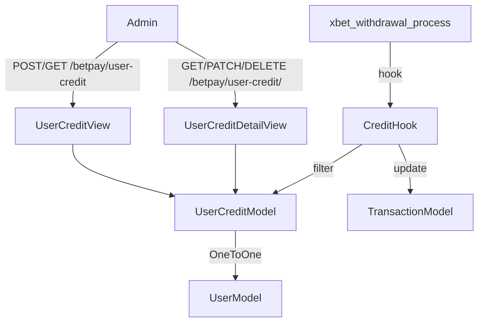
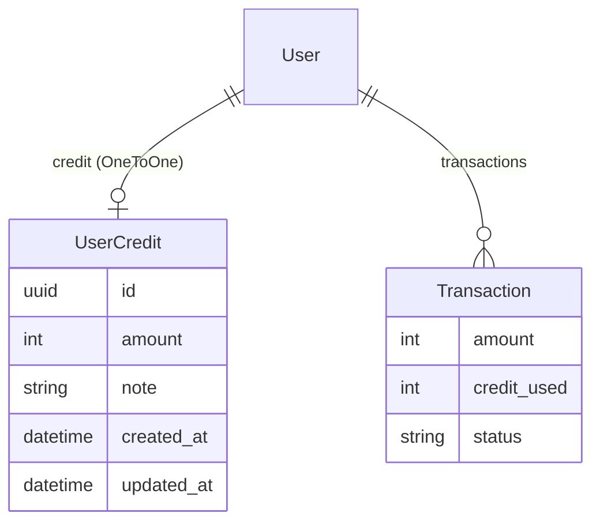

# Design Document — UserCredit

## Overview

La fonctionnalité UserCredit ajoute un mécanisme de crédit manuel attribué par un administrateur à un utilisateur. Ce crédit est automatiquement consommé lors du traitement d'un retrait dans `xbet_withdrawal_process()`, réduisant le montant réel envoyé via l'API de paiement externe. Si le crédit couvre intégralement le retrait, aucun appel externe n'est effectué.

Le système s'intègre dans l'architecture Django REST Framework existante en ajoutant :
- un nouveau modèle `UserCredit` dans `mobcash_inte/models.py`
- un champ `credit_used` sur le modèle `Transaction` existant
- deux vues admin dans `mobcash_inte/views.py`
- un sérialiseur dans `mobcash_inte/serializers.py`
- deux routes sous le préfixe `/betpay/` dans un nouveau fichier `mobcash_inte/admin_urls.py`
- un hook dans `payment.py` au sein de `xbet_withdrawal_process()`

## Architecture



Le préfixe `/betpay/` sera ajouté dans `mobcash_inte_backend/urls.py` en incluant un nouveau fichier `mobcash_inte/admin_urls.py`, pour ne pas polluer les URLs existantes dans `mobcash_inte/urls.py`.

## Components and Interfaces

### Modèle UserCredit (`mobcash_inte/models.py`)

```python
class UserCredit(models.Model):
    id = models.UUIDField(primary_key=True, default=uuid.uuid4, editable=False)
    user = models.OneToOneField(User, on_delete=models.CASCADE, related_name='credit')
    amount = models.PositiveIntegerField(default=0)
    note = models.TextField(blank=True, null=True)
    created_at = models.DateTimeField(auto_now_add=True)
    updated_at = models.DateTimeField(auto_now=True)
```

### Champ `credit_used` sur Transaction (`mobcash_inte/models.py`)

```python
credit_used = models.PositiveIntegerField(default=0)
```

Ajouté à la fin du modèle `Transaction` existant.

### Sérialiseur (`mobcash_inte/serializers.py`)

`UserCreditSerializer` — sérialiseur complet pour lecture/écriture :
- Champs exposés : `id`, `user`, `amount`, `note`, `created_at`, `updated_at`
- `user` en lecture seule (SmallUserSerializer)
- `user_id` en écriture seule (PrimaryKeyRelatedField vers User)
- Validation : `amount >= 0`

### Vues admin (`mobcash_inte/views.py`)

**`UserCreditView`** — `generics.ListCreateAPIView`
- `GET` : liste paginée de tous les `UserCredit`, permission `IsAdminUser`
- `POST` : `get_or_create` sur l'utilisateur, puis écrase `amount` (non additif), permission `IsAdminUser`

**`UserCreditDetailView`** — `generics.RetrieveUpdateDestroyAPIView`
- `GET` / `PATCH` / `DELETE` sur un `UserCredit` par `id` (UUID), permission `IsAdminUser`

### Routes admin (`mobcash_inte/admin_urls.py`)

```python
path("user-credit", UserCreditView.as_view()),
path("user-credit/<uuid:pk>", UserCreditDetailView.as_view()),
```

Inclus dans `mobcash_inte_backend/urls.py` sous le préfixe `betpay/`.

### Hook dans `payment.py`

Inséré dans `xbet_withdrawal_process()` après la vérification `Success == true` et avant le retour `True` :

```python
from mobcash_inte.models import UserCredit

credit = UserCredit.objects.filter(user=transaction.user).first()
if credit and credit.amount > 0:
    credit_to_apply = min(credit.amount, transaction.amount)
    transaction.credit_used = credit_to_apply
    transaction.amount = transaction.amount - credit_to_apply
    credit.amount = max(0, credit.amount - credit_to_apply)
    credit.save()

    # Notification à l'utilisateur propriétaire de la transaction
    notification_content = (
        f"Un crédit de {credit_to_apply} FCFA a été déduit de votre retrait."
        + (f" Raison : {credit.note}" if credit.note else "")
    )
    send_notification(
        title="Crédit appliqué sur votre retrait",
        content=notification_content,
        user=transaction.user,
    )

    if transaction.amount <= 0:
        transaction.amount = 0
        transaction.status = "accept"
        transaction.save()
        return False
```

Si `transaction.amount > 0` après déduction, le flux normal continue (retour `True`).

La notification est envoyée dans tous les cas où un crédit est appliqué (couverture partielle ou totale). Le contenu inclut le montant déduit et, si renseignée, la note du crédit comme raison.

## Data Models



- `UserCredit.amount` : solde courant en FCFA, toujours >= 0
- `Transaction.credit_used` : montant de crédit consommé sur ce retrait, défaut 0
- La relation `OneToOneField` garantit un seul crédit par utilisateur
- `on_delete=CASCADE` : suppression de l'utilisateur entraîne la suppression du crédit

## Correctness Properties

*A property is a characteristic or behavior that should hold true across all valid executions of a system — essentially, a formal statement about what the system should do. Properties serve as the bridge between human-readable specifications and machine-verifiable correctness guarantees.*

### Property 1: Le solde de crédit ne devient jamais négatif

*For any* utilisateur avec un solde de crédit et une transaction de retrait de montant quelconque, après application du crédit, `credit.amount` doit être >= 0.

**Validates: Requirements 6.1, 5.3**

### Property 2: credit_to_apply est borné par le minimum

*For any* paire (credit.amount, transaction.amount) avec des valeurs positives, `credit_to_apply = min(credit.amount, transaction.amount)` doit satisfaire `credit_to_apply <= credit.amount` et `credit_to_apply <= transaction.amount`.

**Validates: Requirements 5.2**

### Property 3: Couverture totale du crédit évite l'appel externe

*For any* transaction dont le montant est inférieur ou égal au crédit disponible, après application du crédit, `transaction.amount == 0`, `transaction.status == "accept"`, et la fonction retourne `False`.

**Validates: Requirements 5.4**

### Property 4: Couverture partielle du crédit poursuit le flux normal

*For any* transaction dont le montant est strictement supérieur au crédit disponible (et crédit > 0), après application du crédit, `transaction.amount > 0` et la fonction retourne `True` pour poursuivre le paiement externe.

**Validates: Requirements 5.5**

### Property 5: Absence de crédit ne modifie pas la transaction

*For any* transaction d'un utilisateur sans `UserCredit` ou avec `credit.amount == 0`, `transaction.amount` et `transaction.credit_used` restent inchangés.

**Validates: Requirements 5.6**

### Property 6: POST user-credit est idempotent sur le remplacement

*For any* utilisateur, envoyer deux requêtes POST successives avec des montants différents doit résulter en `credit.amount` égal au montant de la dernière requête (comportement de remplacement, non additif).

**Validates: Requirements 3.2**

### Property 7: Validation du montant à l'API

*For any* requête POST/PATCH sur `/betpay/user-credit` avec un `amount` négatif, le système doit retourner HTTP 400.

**Validates: Requirements 6.2**

## Error Handling

| Situation | Comportement |
|---|---|
| `user_id` inexistant sur POST | HTTP 404 |
| `id` UserCredit inexistant sur GET/PATCH/DELETE | HTTP 404 |
| Requête non-admin | HTTP 403 (IsAdminUser) |
| `amount` négatif | HTTP 400 (validation sérialiseur) |
| Erreur lors de `credit.save()` dans le hook | Exception propagée → rollback Django |
| `transaction.user` est None | Le hook est ignoré (pas de crédit applicable) |
| Erreur `send_notification` dans le hook | Exception loggée, non bloquante pour la transaction |

Le hook dans `xbet_withdrawal_process()` ne capture pas les exceptions de sauvegarde (requirement 6.3) : elles remontent naturellement pour permettre un rollback de la transaction Django englobante si elle existe.

## Testing Strategy

### Tests unitaires

Couvrent les cas concrets et les conditions d'erreur :
- POST avec `user_id` valide → création et remplacement du montant
- POST avec `user_id` inexistant → HTTP 404
- POST par non-admin → HTTP 403
- PATCH partiel sur un `UserCredit` existant
- DELETE → suppression effective
- Hook avec crédit = 0 → transaction inchangée
- Hook avec crédit couvrant exactement le montant → `status = "accept"`, retour `False`
- Hook avec `transaction.user = None` → pas d'erreur

### Tests de propriétés (property-based)

Librairie recommandée : **`hypothesis`** (Python, intégration native avec pytest/Django).

Configuration minimale : 100 itérations par propriété (`@settings(max_examples=100)`).

Chaque test doit être annoté :
```
# Feature: user-credit, Property N: <texte de la propriété>
```

| Propriété | Test |
|---|---|
| Property 1 | Générer des paires (credit_amount, tx_amount) aléatoires, appliquer le hook, vérifier `credit.amount >= 0` |
| Property 2 | Générer des paires positives, vérifier `credit_to_apply == min(credit, tx)` |
| Property 3 | Générer `tx_amount <= credit_amount`, vérifier `tx.amount == 0`, `status == "accept"`, retour `False` |
| Property 4 | Générer `tx_amount > credit_amount > 0`, vérifier `tx.amount > 0`, retour `True` |
| Property 5 | Générer des transactions sans UserCredit ou avec amount=0, vérifier invariance |
| Property 6 | Générer deux montants distincts, POST successifs, vérifier que le second écrase le premier |
| Property 7 | Générer des entiers négatifs, vérifier HTTP 400 |

Les tests unitaires se concentrent sur les exemples spécifiques et les cas limites (montant = 0, utilisateur sans crédit, erreur de sauvegarde). Les tests de propriétés couvrent la généralité des comportements numériques et des invariants.
